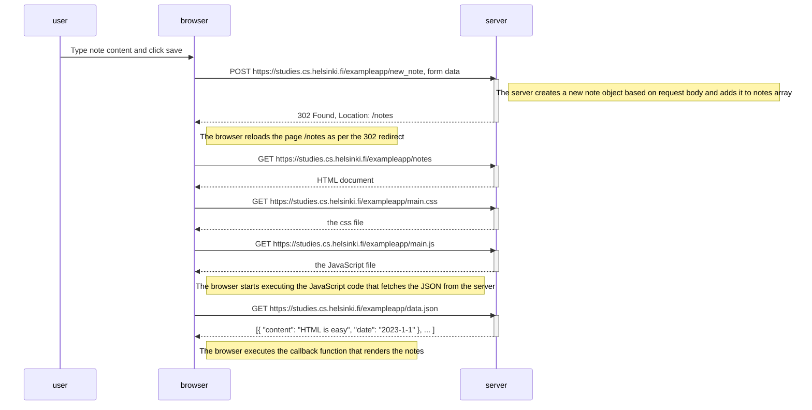

```mermaid
sequenceDiagram;
    participant user
    participant browser
    participant server

    user->>browser: Type note content and click save

    browser->>server: POST https://studies.cs.helsinki.fi/exampleapp/new_note, form data
    activate server
    Note right of server: The server creates a new note object based on request body and adds it to notes array
    server-->>browser: 302 Found, Location: /notes
    deactivate server

    Note right of browser: The browser reloads the page /notes as per the 302 redirect
    
    browser->>server: GET https://studies.cs.helsinki.fi/exampleapp/notes
    activate server
    server-->>browser: HTML document
    deactivate server
    
    browser->>server: GET https://studies.cs.helsinki.fi/exampleapp/main.css
    activate server
    server-->>browser: the css file
    deactivate server
    
    browser->>server: GET https://studies.cs.helsinki.fi/exampleapp/main.js
    activate server
    server-->>browser: the JavaScript file
    deactivate server
    
    Note right of browser: The browser starts executing the JavaScript code that fetches the JSON from the server
    
    browser->>server: GET https://studies.cs.helsinki.fi/exampleapp/data.json
    activate server
    server-->>browser: [{ "content": "HTML is easy", "date": "2023-1-1" }, ... ]
    deactivate server    

    Note right of browser: The browser executes the callback function that renders the notes 
```
