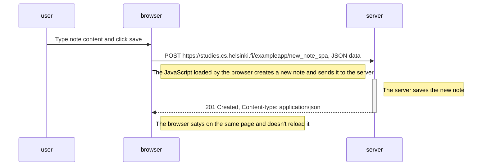

```mermaid
sequenceDiagram
    participant user
    participant browser
    participant server

    user->>browser: Type note content and click save

    browser->>server: POST https://studies.cs.helsinki.fi/exampleapp/new_note_spa, JSON data
    Note right of browser: The JavaScript loaded by the browser creates a new note and sends it to the server
    activate server
    Note right of server: The server saves the new note
    server-->>browser: 201 Created, Content-type: application/json
    deactivate server

    Note right of browser: The browser satys on the same page and doesn't reload it
```
